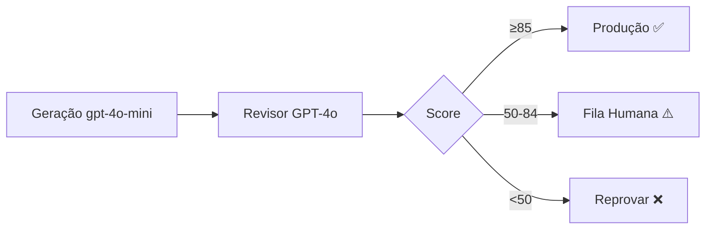

# GPT Revisor de Casos Clínicos - Scopsy

## Meta
Tags: #scopsy #tcc #revisao-clinica #gpt
Status: 🟡 Proposta
Data: 2024-12-31

---

## 🎯 Visão Geral

Sistema de revisão automática de casos clínicos gerados por IA, com 3 camadas:
1. **Revisão GPT** (automática, 71% aprovação)
2. **Revisão Humana** (20% dos casos)
3. **Reprovação** (9% descartados)

**Objetivo:** Garantir qualidade clínica antes de casos chegarem aos usuários

---

## 🏗️ Arquitetura



---

## 📊 Módulos do Scopsy

### 1. Desafios Clínicos (Micro-Momentos)
- **Foco:** Timing terapêutico + decisão em 30s
- **Competência:** "O que dizer AGORA?"
- **Peso maior:** Manejo de resistência + aliança

### 2. Conceitualizações Cognitivas
- **Foco:** Raciocínio clínico estruturado
- **Competência:** "Como funciona esse caso?"
- **Peso maior:** Coerência causal + modelo 5 partes

### 3. Radar Diagnóstico (DSM-5-TR)
- **Foco:** Diagnóstico diferencial
- **Competência:** "Por que esse diagnóstico?"
- **Peso maior:** Critérios DSM + diferenciais

---

## 🔍 Critérios de Revisão

### Camada Comum (TODOS módulos)

#### 🚨 Segurança Clínica (CRÍTICO)
- [ ] Sem linguagem absolutista
- [ ] Sem iatrogenia
- [ ] Respeita complexidade humana

**Exemplos de reprovação automática:**
- ❌ "Cliente é manipulador"
- ❌ "Reagir defensivamente à resistência"

#### 🧠 Coerência Teórica
- [ ] Alinhado com TCC baseada em evidências
- [ ] Não mistura abordagens sem justificativa

#### 📚 Clareza Pedagógica
- [ ] Ensina princípio reutilizável
- [ ] Explica POR QUÊ, não só "resposta certa"

---

### Módulo 1: Micro-Momentos

#### Pesos
- Timing terapêutico: **40%**
- Manejo resistência: **30%**
- Preservação aliança: **20%**
- Economia verbal: **10%**

#### Checklist Timing
- [ ] Adequado ao momento relacional
- [ ] Considera estado emocional atual
- [ ] Não antecipa etapas

#### Escala Validação

| Nível | Tipo | Exemplo |
|-------|------|---------|
| 0 | Invalidante | "Você pode achar simples, mas..." ❌ |
| 1 | Neutro | "Vamos seguir" |
| 2 | Superficial | "Entendo sua dúvida" |
| 3 | Profunda | "Faz sentido desconfiar após tantas tentativas" ✅ |

**Regra:** Se resistência alta → Validação ≥ nível 2 obrigatória

---

### Módulo 2: Conceitualizações

#### Modelo das 5 Partes (30%)
- [ ] Situação
- [ ] Pensamentos
- [ ] Emoções
- [ ] Comportamentos
- [ ] Fisiologia

#### Coerência Causal (40%)
- [ ] Pensamento → Emoção → Comportamento
- [ ] Sequência temporal lógica
- [ ] Compatível com dados

#### Nível de Inferência (20%)
**Diferencia:**
- Pensamento automático ≠ Crença nuclear
- Dado observável ≠ Hipótese
- Sintoma ≠ Diagnóstico

#### Flexibilidade (10%)
- [ ] Apresenta hipóteses alternativas
- [ ] Indica limitações da informação

---

### Módulo 3: Diagnóstico (DSM-5-TR)

#### Critérios DSM Corretos (40%)
- [ ] Todos critérios obrigatórios presentes
- [ ] Duração/frequência respeitada
- [ ] Prejuízo funcional identificado
- [ ] Exclusões verificadas

#### Diferencial Plausível (40%)
**Formato obrigatório:**
```
Diagnóstico: TAG

Diferenciais:
1. Transtorno Pânico
   - Considerado: sintomas somáticos
   - Descartado: sem ataques delimitados

2. Fobia Social
   - Considerado: ansiedade social
   - Descartado: preocupações generalizadas
```

#### Evita Superdiagnóstico (20%)
- [ ] Não diagnostica sem evidência
- [ ] Respeita hierarquia DSM
- [ ] Não patologiza reações normais

---

## 🎚️ Classificação Final

| Score | Classificação | Ação |
|-------|--------------|------|
| ≥85 | EXPERT | ✅ Produção automática |
| 70-84 | ADEQUADA | ✅ Produção (log para análise) |
| 50-69 | QUESTIONÁVEL | ⚠️ Fila revisão humana |
| <50 | INADEQUADA | ❌ Reprovar |

---

## 💰 Custo & ROI

### Por Caso
- Input: ~800 tokens
- Output: ~400 tokens
- Custo: **$0.006/caso**

### Para 1.000 casos
- Custo GPT: **$6**
- Tempo: 10min (paralelo)

### Economia
- Sem revisor: 66h de trabalho humano
- Com revisor: 1h (só casos questionáveis)
- **Economia: 98.5%**

---

## 🚀 Implementação

### Fase 1: MVP (1-2 semanas)
- [ ] `case-review-service.js`
- [ ] Revisor Micro-Momentos
- [ ] Interface simples admin
- [ ] Testar com 50 casos

### Fase 2: Expansão (2-3 semanas)
- [ ] Revisor Conceitualizações
- [ ] Revisor Diagnóstico
- [ ] Dashboard métricas
- [ ] API supervisoras

### Fase 3: Automação (1 mês)
- [ ] Sistema aprende com humanos
- [ ] Auto-calibração thresholds
- [ ] Revisão batch casos existentes

---

## 📈 Métricas de Sucesso

### KPIs
- Taxa aprovação automática: **>70%**
- Taxa reprovação: **<10%**
- Tempo médio revisão humana: **<5min/caso**
- Concordância GPT vs Humano: **>85%**

### Dashboard
```
Cases gerados:       1.247
├─ Aprovados auto:     892 (71.5%) ✅
├─ Revisão humana:     248 (19.9%) ⚠️
└─ Reprovados:         107 (8.6%)  ❌

Problemas mais comuns:
1. Validação inadequada: 34%
2. Diferenciais ausentes: 28%
3. Critérios DSM incorretos: 21%
```

---

## 🔗 Links

- [[Arquitetura Scopsy]]
- [[TCC Protocolos]]
- [[DSM-5-TR Critérios]]

---

## 📝 Notas

> **Insight crítico:** O problema não é a qualidade média dos casos gerados, mas os **outliers perigosos** (8-9%) que ensinam técnicas iatrogênicas.
>
> Revisor GPT elimina 100% desses casos antes de chegarem aos usuários.

---

## ✅ Próximos Passos

- [ ] Validar arquitetura com equipe
- [ ] Implementar revisor Micro-Momentos
- [ ] Revisar 50 casos existentes do banco
- [ ] Criar interface fila revisão humana
